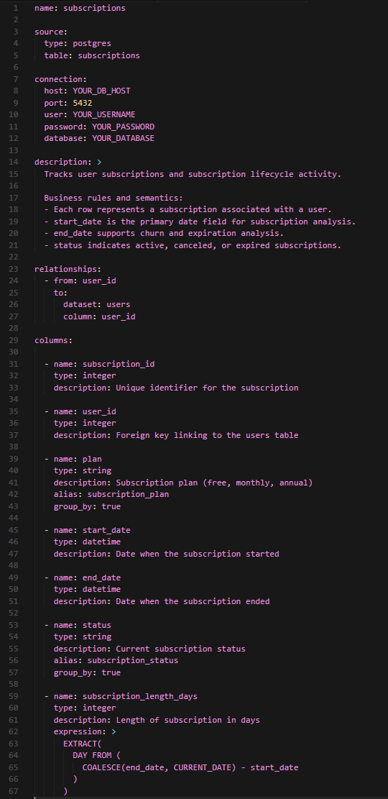
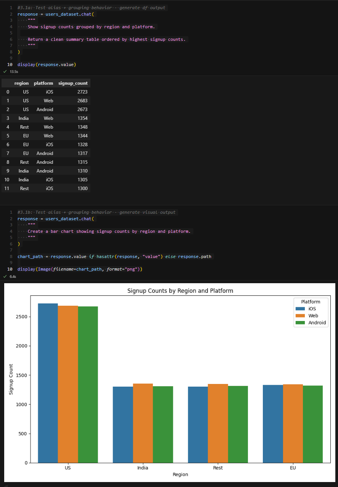
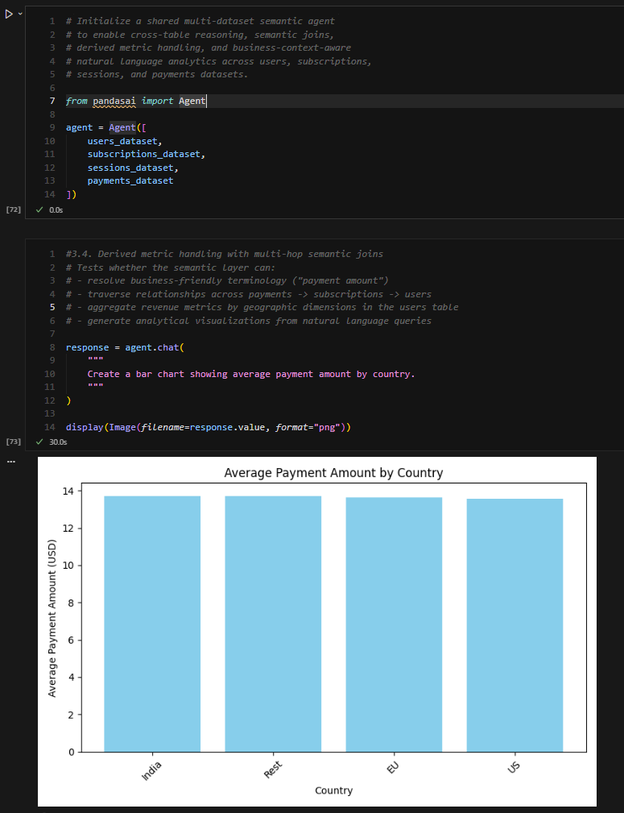
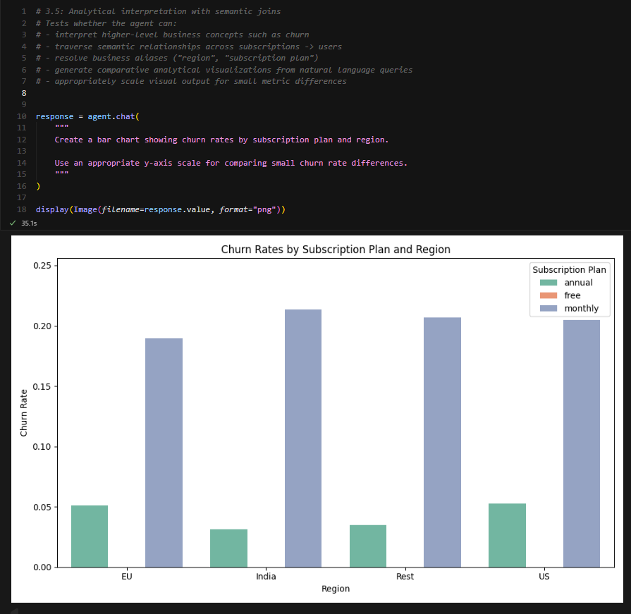
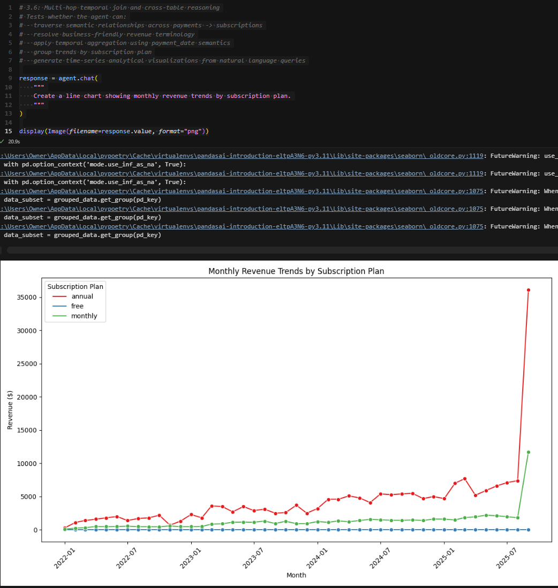

# PandasAI Introduction

An interactive notebook-based introduction to PandasAI and semantic-layer-driven natural language analytics using PostgreSQL-backed datasets. This project demonstrates how semantic metadata, cross-table relationships, and multi-dataset agent orchestration can improve conversational analytics systems.

## Features

* Natural language querying against PostgreSQL datasets
* Semantic layer configuration using reusable YAML definitions
* Alias resolution and business-friendly terminology mapping
* Cross-table semantic joins and multi-dataset reasoning
* Temporal aggregation and derived metric handling
* Analytical visualization generation from natural language prompts

---

## Setup

### Prerequisites

* Python 3.10 or 3.11
  (`pandasai-sql` does not currently support Python 3.12)
* Poetry
* OpenAI API Key

---

## Installation

### 1. Install Poetry

**Windows (PowerShell)**

```powershell
(Invoke-WebRequest -Uri https://install.python-poetry.org -UseBasicParsing).Content | py -
```

**macOS/Linux**

```bash
curl -sSL https://install.python-poetry.org | python3 -
```

---

### 2. Install Dependencies

```bash
poetry install
```

---

### 3. Configure Environment Variables

Copy the example environment file:

**Windows**

```powershell
copy .env.example .env
```

**macOS/Linux**

```bash
cp .env.example .env
```

Then populate `.env` with your credentials:

```env
OPENAI_API_KEY=sk-your-key-here
DB_HOST=your-database-host
DB_USER=your-username
DB_PASS=your-password
DB_NAME=your-database-name
DB_PORT=5432
```

---

## Running the Notebook

1. Open `pandasai_quickstart_guide.ipynb` in Cursor or VS Code
2. Select the Poetry kernel
3. Run notebook cells sequentially

If needed, install the Jupyter extension for Cursor:
https://cursor.dev/docs/extension/jupyter

## View Notebook
- 📊 [View with outputs](https://Sri-Bandhakavi.github.io/pandasai-quickstart-guide/pandasai_quickstart_guide.html)
- ▶️ [Run it yourself](pandasai_quickstart_guide.ipynb)

---

## Example Outputs

The notebook includes a series of semantic layer validation tests covering alias resolution, temporal aggregation, derived metrics, and cross-table reasoning.

### Semantic Layer Configuration



### Alias and Grouping Validation



### Cross-Table Revenue Analysis



### Churn Analysis by Region



### Revenue Trend Analysis



---

## Project Structure

```text
pandasai-quickstart-guide/
├── assets/
│   └── screenshots/
├── datasets_public/
├── pandasai_quickstart_guide.ipynb
├── AGENTS.md
├── pyproject.toml
├── poetry.lock
├── .env.example
├── .gitignore
└── README.md
```

---

## Notes

* Semantic layer YAML files may require manual relationship configuration depending on the PandasAI version used.
* Cross-table reasoning is most reliable when using a shared multi-dataset `Agent` context.
* `poetry.lock` is committed to ensure reproducible dependency versions across environments.
